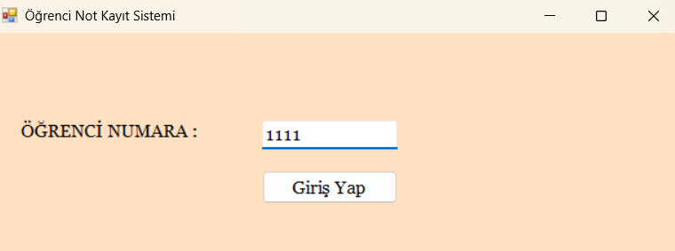
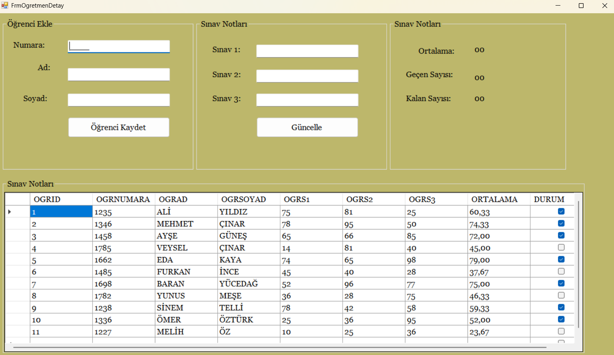
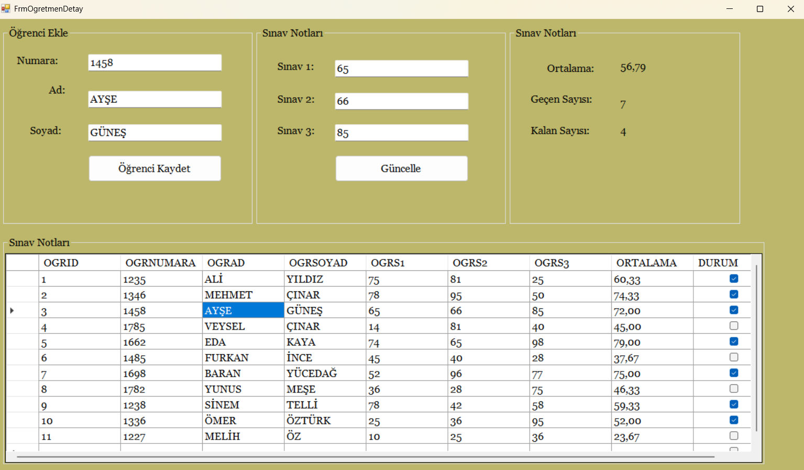
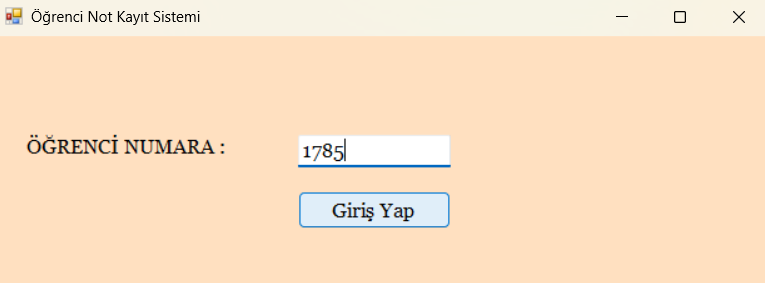
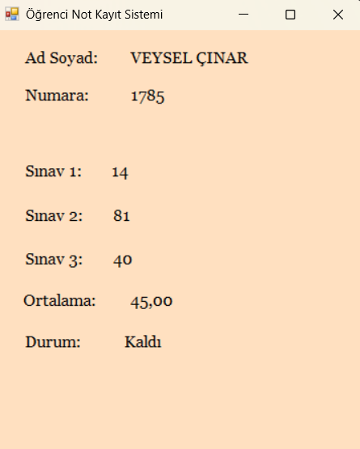

# 📚 ÖĞRENCİ NOT KAYIT SİSTEMİ
## 📝 PROJENİN AMACI
### Bu proje, öğrencilerin sınav notlarının sistematik bir şekilde kaydedilmesi, her öğrencinin kendi numarasıyla sisteme giriş yaparak sınav notlarını görüntüleyebilmesi ve öğretmenlerin öğrencilere ait sınav notlarını ekleyip güncelleyebilmesi için tasarlanmış bir not kayıt sistemidir.

<h2>Özellikler</h2>

<ul>
  <li>
    <strong>Öğrenci Girişi:</strong> Öğrenciler, öğrenci numaralarını kullanarak sisteme giriş yapabilir ve yalnızca kendi sınav notlarını görüntüleyebilir.
  </li>
  <li>
    <strong>Öğretmen Girişi:</strong> Öğretmenler sisteme giriş yaparak:
    <ul>
      <li>Öğrenci ekleyebilir.</li>
      <li>Öğrenci bilgilerini güncelleyebilir.</li>
      <li>Sınav notlarını kaydedebilir veya düzenleyebilir.</li>
    </ul>
  </li>
  <li>
    <strong>Not Analizi:</strong>
    <ul>
      <li>Öğrencilerin sınav ortalaması hesaplanır.</li>
      <li>Geçen ve kalan öğrenci sayıları ayrı olarak gösterilir.</li>
    </ul>
  </li>
</ul>

<h2>Kullanılan Teknolojiler</h2>
<ul>
  <li>Programlama Dili: C#</li>
  <li>Görsel Arayüz: Windows Forms</li>
  <li>Veritabanı: Microsoft SQL Server</li>
</ul>

<h2>Geliştirme Ortamı</h2>
<ul>
  <li>IDE: Visual Studio</li>
</ul>

#### EKRAN GÖRÜNTÜLERİ

